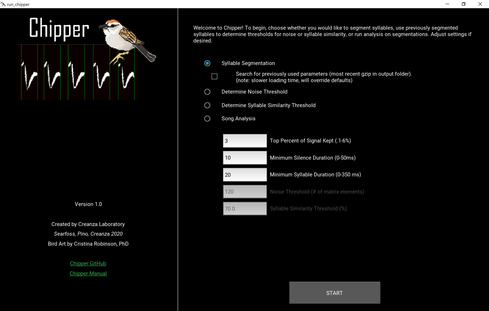
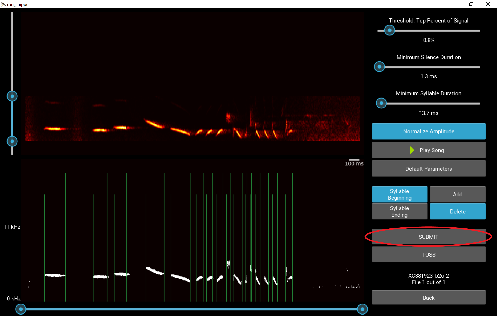
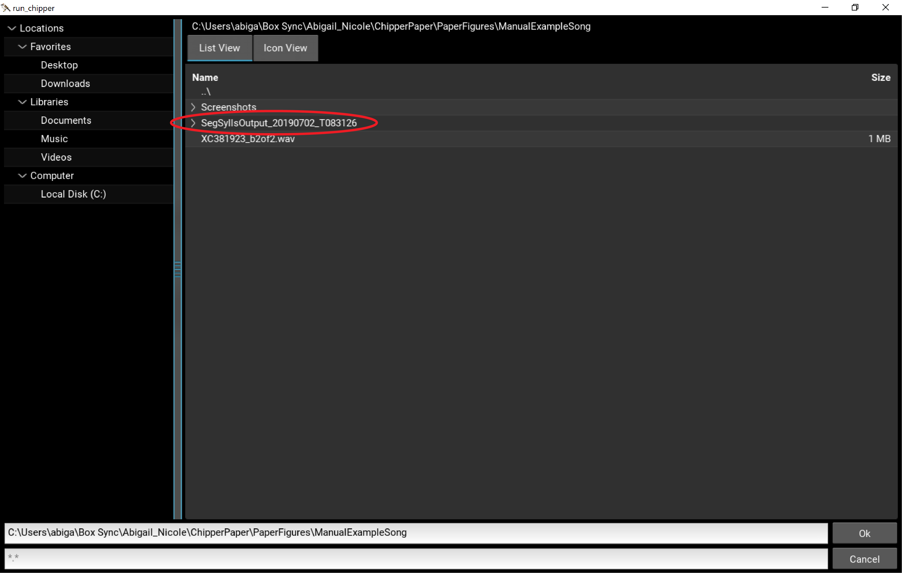
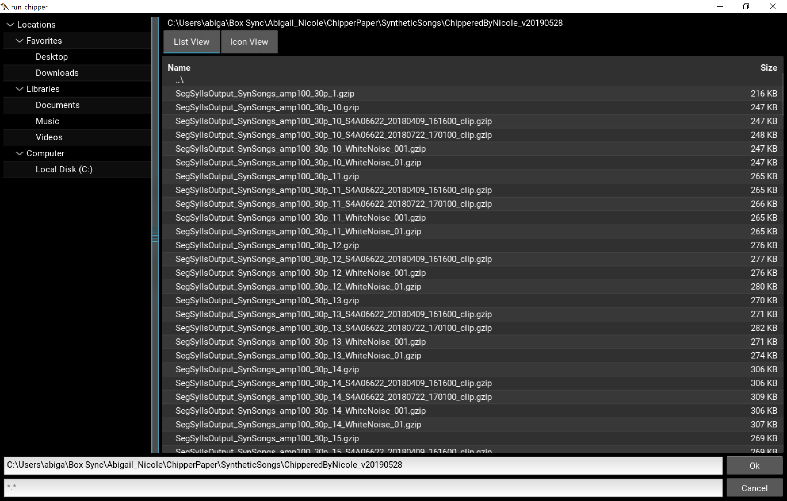

**Table of Contents**

 1.  How to Install

 2.  Overview

 3.  Syllable Segmentation

 4.  Example of Syllable Segmentation

 5.  Noise Threshold Widget

 6.  Syllable Similarity Threshold Widget

 7.  Running Analysis

 8.  Analysis Output

**How to Install**

Install from source

 1.  Install Anaconda
 
>Our recommended approach is to use Anaconda, which is a distribution of 
>Python containing most of the numeric and scientific software needed to get 
>started. If you are a Mac or Linux user, have used Python before and are 
>comfortable using pip to install software, you may want to skip this step 
>and use your existing Python installation.

 2.  From within a terminal or command prompt window we will install most 
 packages with conda

    $ conda create -n chipper\_env python=3.7\
    $ condapip install pypiwin32 kivy.deps.sdl2 kivy.deps.glew\
    $ kivy.deps.gstreamer kivy.deps.glew\_dev kivy.deps.sdl2\_dev\
    $ kivy.deps.gstreamer\_dev

 3.  Additional steps for Windows users:

    $ pip install pypiwin32 kivy.deps.sdl2 kivy.deps.glew kivy.deps.gstreamer kivy.deps.glew\_dev kivy.deps.sdl2\_dev kivy.deps.gstreamer\_dev

 4.  Install kivy packages

    $ garden install \--kivy graph\
    $ garden install \--kivy filebrowser\
    $ garden install \--kivy matplotlib\
    $ garden install \--kivy progressspinner

For full code visit
[https://github.com/CreanzaLab/chipper](https://github.com/CreanzaLab/chipper).

**Overview**

The Chipper landing page allows you to choose whether you want to

 1.  segment songs (or other acoustic signals)

 2.  determine the threshold for noise

 3.  determine the threshold for syllable similarity, or

 4.  complete analysis of already segmented files.

These steps should be conducted in the order listed.

For **Syllable Segmentation** choose parameter defaults for top percent
of signal kept, minimum silence duration, and minimum syllable duration
with which to start the parsing of every song. You can also select
"Search for previously used parameters" which will look for gzips in any
*SegSyllsOuput\_YYYYMMDD\_THHMMSS* folders in the selected folder for
segmentation. If any gzips are found, the most recent one will be used
to load the previous settings and segmentation conducted for the song.

For **Song Analysis** choose parameters for noise threshold (to distinguish
between signal and noise) and percent syllable similarity (to determine
syntax). We suggest first using the threshold widgets for best results;
after finishing each widget, the new parameter for analysis will be
populated.

**Syllable Segmentation**

Starting Syllable Segmentation will first take you to a file explorer to
choose either a single WAV file or folder of WAV files. The length of
the songs and the size of the files Chipper can handle depends greatly on 
your computing resources and screen size. We recommend songs \~0.5s to 10s 
long or files no larger than 3MB. Depending on the computing resources you may
experience lag with files between 2-3MB. Thus, we recommend choosing
bouts of song to segment using another program such as Audacity
(audacity.sourceforge.net).

*Note: We have set a warning message for files over 3MB in which the user
can select to either toss or process the file; this is a safety to
ensure the user knows they may experience a lag or even crash Chipper if
the file is much larger than recommended and has not been previously
parsed. If you are consistently parsing files larger than this with no 
issue and want to change this threshold, see line 344 of control\_panel.py 
(and line 267 in run\_chipper.kv for popup message).*

Each file will load using the default parameters to automatically
parse the song. Next adjust the parameters to finalize your
segmentation.

Here is a suggested order in changing parameters:

 1.  Adjust the high-pass and low-pass filter slider (left of top spectrogram).

 2.  If there are some portions of the song that seem very low in amplitude,
  try normalizing the signal.

 3.  Adjust the signal threshold to reduce noise.

     *Tip: You can use the crop sliders (under the bottom spectrogram) to 
     remove the onsets/offsets temporarily to see if you like what the 
     signal threshold is giving you without having the lines crowd your view. 
     Be sure to put these sliders back after you are done, as the onsets and
      offsets must be in place to submit a segmentation.*

4.  Adjust minimum silence duration to the ***minimum value*** that segments
 the way you think is correct. Using the smallest value that gives you good 
 parsing will help if you have spots of noise right on the edge of a 
 syllable; it will cut the speck of noise out of the actual syllable. On the
  other hand, if you are trying to get two parts of a syllable that are far 
  apart from one another to parse together, try increasing the minimum 
  silence duration quite a bit.

5.  You may need to iterate between steps \#3 and \#4.

6.  Use minimum syllable duration if you are still not satisfied with the 
parsing. Usually you will not have to adjust this parameter much or at all. 
(However, this will depend on the song type you are parsing.) It is often 
useful in getting rid of little bits of noise that are parsing as syllables 
or include small syllables that are not parsing.    

7.  Use the crop sliders (under the bottom spectrogram) to remove onsets and
 offsets capturing any signal before or after the song.  

8.  Add/Delete any onsets/offsets that are missing or extraneous. Try to add
 as few manual onsets/offsets as possible. It is better to have too many and
  have to remove.

    *Tip: Use the left and right arrow keys to move between the selected 
    onset/offset and the others. Use "Enter" to accept addition or deletion of 
    onsets/offsets. Use "x" to cancel addition or deletion of onsets/offsets.*

9.  Submit your parsed song, or toss if you think it is too noisy and you 
are not getting good data!

    *Careful not to hit submit or toss twice in a row. If you think the 
    button did not work, it might just be loading the next file. The 
    **buttons should turn blue if they have been selected** and will be gray
     again when the new image is loaded.*

Once you have parsed all the files in a folder, there will be a new folder 
called *SegSyllsOutput_YYYYMMDD_THHMMSS*. For every WAV file that was 
successfully segmented, there will be an associated gzip which will be used 
in the next steps in Chipper. Specifically each gzip is written after the 
user hits “Submit”. These gzips are used to review the segmentation again 
using Syllable Segmentation or to determine Thresholds and run Analysis in 
the next steps.   

In addition, four human-readable text files are output once the last file is
 either submitted or tossed.          

1. *segmentedSyllables\_parameters\_all*  includes a list of all the Chipper
 parameters used to reach the submitted segmentation. 
 
 | | |
 |---|---|
 | FileName | name of WAV file |
 | FrequencyFilter | [high-pass, low-pass] filter in number of pixels from the bottom of the spectrogram |
 | BoutRange | [left crop, right crop] in pixels from teh left of the spectrogram |
 | PercentSignalKept | top percent of signal kept |
 | MinSilenceDuration | number of pixels |
 | MinSyllableDuration | number of pixels |
 | Normalized | 'yes' or 'no' indicating whether the song was normalized or not |

2. *segmentedSyllables\_syllables\_all* with a list of onsets and a list of 
offsets in pixels from the left of the spectrogram.  

3. *segmentedSyllables\_conversions\_all* includes the conversions necessary
 to change the parameters from pixels into milliseconds or Hz for each WAV 
 file processed.  
 
 | | |
 |---|---|
 | FileName | name of WAV file |
 | timeAxisConversion | number of milliseconds per pixel|
 | BoutRange | number of Hz per pixel|

4. *segmentedSyllables\_tossed* with a list of the files that were tossed. 
There should be no gzips provided for the files in this list.  

*Note: If Chipper crashes during segmentation (or the user exits Chipper), the
text files will not be output; however, gzips for any segmentations that
were submitted will be present in the output folder. To run the next
steps, only gzips are needed. The text outputs are solely for the user's
information.*

**Example of Syllable Segmentation**

 1. Select "Syllable Segmentation".
 

 2. Navigate to and select a WAV file or folder of WAV files to parse. 
 Double click ..\\ if you need to go back up a folder. In this case we are 
 using the second bout from the Xeno Canto recording 381923. (XC381923 
 contributed by Lucas, Creative Commons Attribution-NonCommercial-ShareAlike
  4.0, [https://www.xeno-canto.org/381923](https://www.xeno-canto.org/381923)).
   

 3. Click "Begin Segmentation".

    

 4. The file is loaded with segmentation using the default parameters. In 
 this case, we did not change the defaults on the landing page.
    

 5. Adjust the low-pass and high-pass filters.
    

 6. Adjust the signal threshold to reduce noise. (You may come back and 
 tweak this again.)
    
    
 7. Select Normalize Amplitude as some of the small syllables (especially 
 the one on the right end) are fading away with the reduction in signal 
 threshold.
    

 8. Adjust minimum silence duration. This both got rid of some of the onsets
  and offsets around noise on the ends of the song as well as some of the 
  noise at the end of syllables that appears to be an echo.
    

 9. Use minimum syllable duration to get the beginning of the last syllable 
 and the two small syllables in the middle of the song that have no onsets 
 or offsets.
    

 10. Add/Delete any onsets/offsets that are missing or extraneous. Here we 
 delete two syllable beginnings and two syllable endings.
     
     
     
     
     
     
     

11. Segmentation looks good, select Submit!
    

12. Exit Syllable Segmentation and return to the landing page where you can 
continue to parse another folder of WAV files or can continue with this set 
in the threshold widgets and analysis.
    

13. The output folder, *SegSyllsOutput\_YYYYMMDD\_THHMMSS* can now be found in 
the same folder as the WAV files you ran. This folder contains the three 
human-readable text file outputs as well as the gzips for each submitted WAV
 file.
    
    
    

**Noise Threshold Widget**

The purpose of the widget is to help you determine a common threshold
for noise for all of your data. We recommend you perform this step
for a set of songs from the same species. Specifically, you can use a
subset of your data (\~20 songs) to determine the threshold. You will
adjust the threshold for each song until satisfied with the results. A
summary of the thresholds used for the sample songs will be given at the
end. Then, you will be given the chance to adjust the final threshold to
be used in song analysis.

The colors are to help you distinguish separate notes. A note is considered 
to be a set of connected elements (by edges not corners, e.g. 4-connected) 
in the binary spectrogram having an area greater than the noise threshold. 
So, if two notes very close to one another appear separate and are the same 
color, they are most likely one note. This may be due to the limits of 
screen resolution. If the area of a note is smaller than the Noise 
Threshold, it will be considered noise appearing white in the spectrogram. 
Noise will not be considered in the analysis calculations.

You can return to this widget as many times as you wish to visualize the 
chosen threshold for any songs of interest.

Below is the example song with the *default* noise threshold. In this case, 
there only looks to be one syllable that has signal being incorrectly 
labeled as noise.   
    

Reducing the noise threshold, the second note of the syllable is now 
correctly labeled. Here is the example song with the *adjusted* noise 
threshold.
    

**Syllable Similarity Widget**

The purpose of the widget is to help you determine a common threshold
for syllable similarity for all of your data. We recommend you perform
this step for a set of songs from the same species. Specifically, you
can use a subset of your data (\~20 songs) to determine the threshold.
You will adjust the threshold for each song until satisfied with the
results. A summary of the thresholds used for the sample songs will be
given at the end. Then, you will be given the chance to adjust the final
threshold to be used in song analysis.

The colors are to help you distinguish the syntax of the song which is also 
written numerically above the spectrogram. Two syllables are considered to 
be identical if they overlap with an accuracy greater than or equal to the 
syllable similarity threshold. The syntax is found sequentially, meaning if 
the second syllable is found to be the same as the first, and the third 
syllable is found to be the same as the second but not the first, the third 
will still be the same as both the first and second syllables. To help, the 
average, minimum and maximum percent similarity between like syllables is 
also provided. Note: the minimum can be less than the threshold because 
syntax is found sequentially.

Any signal between syllables will be grey and will not be considered in the 
analysis. Similarly, any noise (determined using the Noise Threshold from 
the previous step) will be white and will not be considered in the analysis.

You can return to this widget as many times as you wish to visualize the 
segmentation and chosen threshold for any songs of interest.  

Below is the example song with the *default* syllable similarity threshold. In
 this case, the syntax is close to what we would consider correct for this 
 bird; however, there are a set of three similar syllables at the end that 
 are labeled “12, 13, 12”.   
    

Adjusting the syllable similarity threshold allows us to reach the correct 
syntax. Here is the example song with the *adjusted* syllable similarity 
threshold.
    

**Running Analysis**

The Noise Threshold and Syllable Similarity Threshold will be used
in Song Analysis. If you have not used the two widgets to determine
appropriate thresholds, do so before running Song Analysis.

Starting Song Analysis will first take you to a file explorer to choose
a folder of gzip outputs from Syllable Segmentation.

*Note: The gzips do not have to be in their original output folder; the
user could have moved them to a new location. If other file types are in
the same folder, they will be ignored.*

A popup will appear with the number of gzips that will be processed. You
can either select "Back" or "Run". When "Run" is selected, a new
progress page will appear (see below). The number of files will be
incremented as the analysis is completed. Any errors in analysis should
throw an exception, printing the error to the analysis page and skipping
the current gzip; the error messages will also be logged in a text file
named *AnalysisOutput\_YYYYMMDD\_THHMMSS\_error\_log*. While Song Analysis
is running, if needed, use the active button to "Cancel Analysis and
Exit" Chipper.

When all gzips are completed, the spinning wheel will no longer be present, 
and the button “Return to Home” will become active. Two Song Analysis output
 files can now be found in the folder you analyzed.

1. *AnalysisOutput\_YYYYMMDD\_THHMMSS\_songsylls* with measurements pertaining
 to the song and syllables.
2. *AnalysisOutput\_YYYYMMDD\_THHMMSS\_notes* with measurements pertaining to 
the notes. The user should be careful using these measurements as noisy 
song files will not have accurate note information. 

**Analysis Output**

Together the *AnalysisOutput\_YYYYMMDD\_THHMMSS\_songsylls* and 
*AnalysisOutput\_YYYYMMDD\_THHMMSS\_notes* files include
 42 measurements for all gzips run through Song Analysis and the two 
 thresholds submitted by the user for the calculations.

Noise Threshold is used to remove any connected signal with an area less 
than or equal to the submitted parameter. This is done very first such that 
all note-related and frequency-related calculations will be affected by this
 last bit of “cleaning”. Any calculations that specifically use the onsets and 
 offsets will not be affected.

Syllable Similarity Threshold is used to determine if two syllables are
considered to be of the same type. This affects syllable pattern
(syntax) and any measures associated with it---sequential repetition,
syllable stereotypy, and mean and standard deviation of syllable
stereotypy.

All Syllable calculations are conducted on the signal between onsets and
offsets.

For definitions of each of the measurements see the table below; for
more detailed information see
[https://github.com/CreanzaLab/chipper/blob/master/chipper/analysis.py](https://github.com/CreanzaLab/chipper/blob/master/chipper/analysis.py).
  
  | term | calculation |
  |---|---|
  | avg\_note\_duration(ms) | mean(time of note beginning − time of note ending) |
  | avg\_notes\_freq\_modulation(Hz) | mean(note frequency peak − note frequency trough) |
  | avg\_notes\_lower\_freq(Hz) | mean(minimum frequency of each note) |
  | avg\_notes\_upper\_freq(Hz) | mean(maximum frequency of each note) |
  | avg\_silence\_duration(ms) | mean(time of syllable onset − time of previous syllable offset) |
  | avg\_syllable\_duration(ms) | mean(time of syllable offset − time of syllable onset) |
  | avg\_sylls\_freq\_modulation(Hz) | mean(syllable frequency peak − syllable frequency trough) |
  | avg\_sylls\_lower\_freq(Hz) | mean(minimum frequency of each syllable) |
  | avg\_sylls\_upper\_freq(Hz) | mean(maximum frequency of each syllable) |
  | bout\_duration(ms) | (time of last syllable offset − time of first syllable onset) |
  | largest\_note\_duration(ms) | max(time of note beginning − time of note ending) |
  | largest\_notes\_freq\_modulation(Hz) | max(note frequency peak − note frequency trough) |
  | largest\_silence\_duration(ms) | max(time of syllable onset − time of previous syllable offset) |
  | largest\_syllable\_duration(ms) | max(time of syllable offset − time of syllable onset) |
  | largest\_sylls\_freq\_modulation(Hz) | max(syllable frequency peak − syllable frequency trough) |
  | max\_notes\_freq(Hz) | max(maximum frequency of each note) |
  | max\_sylls\_freq(Hz) | max(maximum frequency of each syllable) |
  | mean\_syllable\_stereotypy | mean(syllable\_stereotypy) |
  | min\_notes\_freq(Hz) | min(minimum frequency of each note) |
  | min\_sylls\_freq(Hz) | min(minimum frequency of each syllable) |
  | note\_size\_threshold | provided by user |
  | num\_notes | number of 4-connected elements of the spectrogram with an area greater than the note size threshold |
  | num\_notes\_per\_syll | (total number of notes)/(total number of syllables) |
  | num\_syllable\_per\_bout\_duration(1/ms) | (number of syllables)/(song duration) |
  | num\_syllables | number of syllable onsets in a song |
  | num\_syllables\_per\_num\_unique | (number of syllable onsets in a song)/(unique values in syllable pattern) |
  | num\_unique\_syllables | unique values in syllable pattern |
  | overall\_notes\_freq\_range(Hz) | max(maximum frequency of each note) − min(minimum frequency of each note) |
  | overall\_sylls\_freq\_range(Hz) | max(maximum frequency of each syllable) − min(minimum frequency of each syllable) |
  | sequential\_repetition | number of repeated syllables/(number of syllables - 1) |
  | smallest\_note\_duration(ms) | min(time of note beginning − time of note ending) |
  | smallest\_notes\_freq\_modulation(Hz) | min(note frequency peak − note frequency trough) |
  | smallest\_silence\_duration(ms) | min(time of syllable onset − time of previous syllable offset) |
  | smallest\_syllable\_duration(ms) | min(time of syllable offset − time of syllable onset) |
  | smallest\_sylls\_freq\_modulation(Hz) | min(syllable frequency peak − syllable frequency trough) |
  | std\_note\_duration(ms) | std(time of note beginning − time of note ending) |
  | std\_notes\_freq\_modulation(Hz) | std(note frequency peak − note frequency trough) |
  | std\_silence\_duration(ms) | std(time of syllable onset − time of previous syllable offset) |
  | std\_syllable\_duration(ms) | std(time of syllable offset − time of syllable onset) |
  | std\_syllable\_stereotypy | std(syllable\_stereotypy) |
  | std\_sylls\_freq\_modulation(Hz) | std(syllable frequency peak − syllable frequency trough) |
  | syll\_correlation\_threshold | provided by user |
  | syllable\_pattern | pattern in which syllables considered to be the same type had a maximum overlap of signal (using sliding window in time, not frequency space) greater than or equal to the syllable similarity threshold |
  | syllable\_stereotypy | list of the mean(correlation between each pair of like syllables) |
