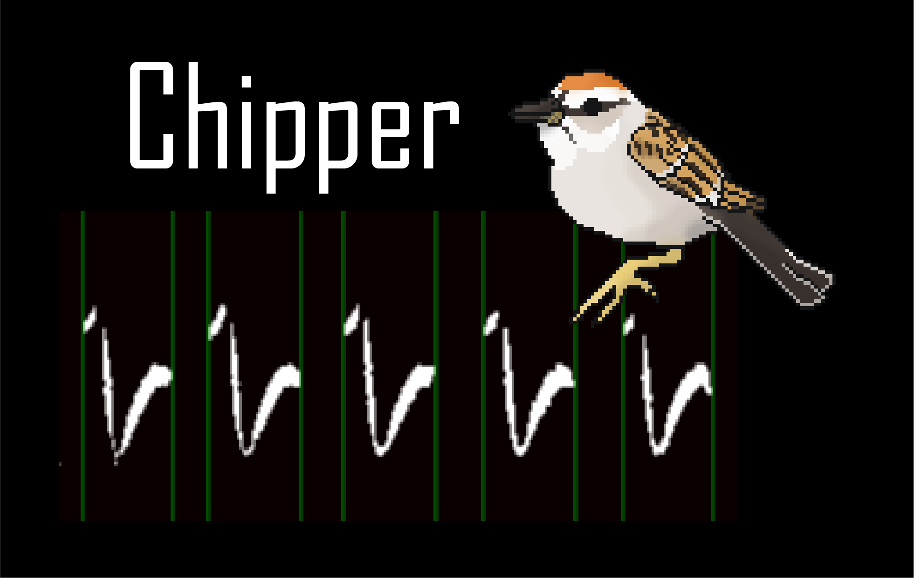
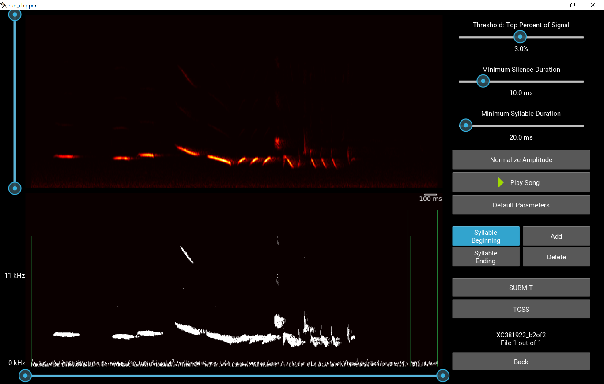
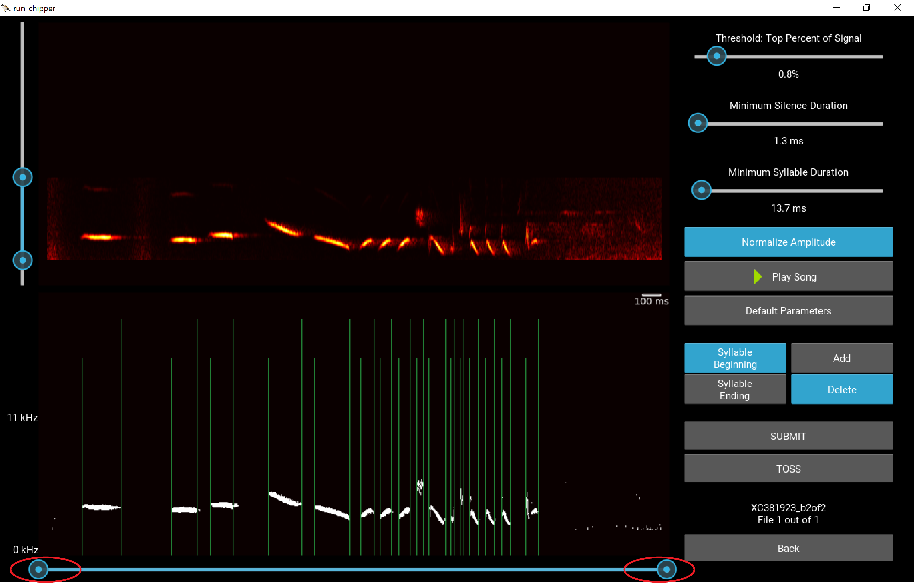
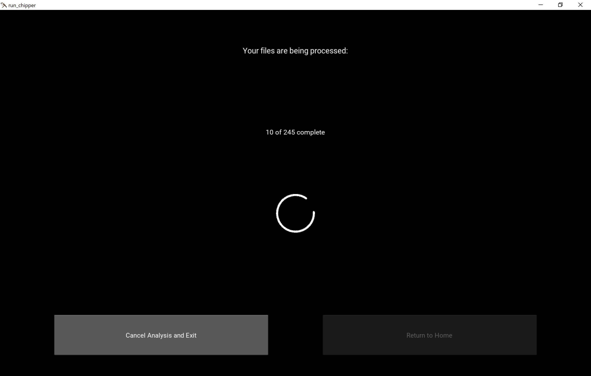

**Table of Contents**

 1.  [How to Install](#how-to-install)

 2.  [Overview](#overview)

 3.  [Syllable Segmentation](#syllable-segmentation)

 4.  [Example of Syllable Segmentation](#example-of-syllable-segmentation)

 5.  [Noise Threshold Widget](#noise-threshold-widget)

 6.  [Syllable Similarity Threshold Widget](#syllable-similarity-threshold-widget)

 7.  [Running Analysis](#running-analysis)

 8.  [Analysis Output](#analysis-output)

### How to Install

Option 1: Download Chipper

1. [Download](https://github.com/CreanzaLab/chipper/releases) the correct version of Chipper for your operating system.
2. Unzip the folder.
3. Navigate to and double click the executable named chipper.exe, which may 
have
a bird as an icon. 
4. You will now see a terminal window open, and soon after, the
Chipper landing page will load. You are ready to go!

Option 2: Install from source (primarily for developers)

 1.  Install Anaconda
 
>Our recommended approach is to use Anaconda, which is a distribution of 
>Python containing most of the numeric and scientific software needed to get 
>started. If you are a Mac or Linux user, have used Python before and are 
>comfortable using pip to install software, you may want to skip this step 
>and use your existing Python installation.

 2.  From within a terminal or command prompt window we will install most 
 packages with conda

    $ conda create -n chipper_env python=3.7
    $ condapip install pypiwin32 kivy.deps.sdl2 kivy.deps.glew
    $ kivy.deps.gstreamer kivy.deps.glew_dev kivy.deps.sdl2_dev
    $ kivy.deps.gstreamer_dev

 3.  Additional steps for Windows users:

    $ pip install pypiwin32 kivy.deps.sdl2 kivy.deps.glew kivy.deps.gstreamer kivy.deps.glew_dev kivy.deps.sdl2_dev kivy.deps.gstreamer_dev

 4.  Install kivy packages

    $ garden install --kivy graph
    $ garden install --kivy filebrowser
    $ garden install --kivy matplotlib
    $ garden install --kivy progressspinner

For full code visit
[https://github.com/CreanzaLab/chipper](https://github.com/CreanzaLab/chipper).

### Overview

The Chipper landing page allows you to choose whether you want to

 1.  segment songs (or other acoustic signals)

 2.  determine the threshold for noise

 3.  determine the threshold for syllable similarity, or

 4.  complete analysis of already segmented files.

These steps should generally be conducted in the order listed. Steps 2 and 3
 can be skipped if you have already determined appropriate thresholds for 
 your study.  
 

For **Syllable Segmentation**, the user can choose parameter defaults for top 
percent of signal kept, minimum silence duration, and minimum syllable 
duration; these defaults will start the parsing of every song. You can also 
select "Search for previously used parameters" which will look for gzips in 
any *SegSyllsOuput\_YYYYMMDD\_THHMMSS* folders in the selected folder for
segmentation. If any gzips are found, the most recent one will be used
to load the previous settings and segmentation conducted for the song.

For **Song Analysis**, the user can choose parameters for noise threshold (to 
distinguish between signal and noise) and percent syllable similarity (to 
determine syntax). We suggest first using the noise and syllable similarity 
threshold widgets for best results; after finishing each widget, the new 
parameter for analysis will be populated.

### Syllable Segmentation

Starting Syllable Segmentation will first take you to a file explorer to
choose either a single WAV file or folder of WAV files. The length of
the songs and the size of the files Chipper can handle depends greatly on 
your computing resources and screen size. We recommend songs between \~0.5s 
and 10s long or files no larger than 3MB. Depending on the computing 
resources, you may experience lag with files between 2-3MB. Thus, we 
recommend choosing bouts of song to segment using another program such as 
Audacity (audacity.sourceforge.net). Similarly, if a bout is very short, it 
may appear stretched; you can always reduce this effect when selecting a 
bout in Audacity by not cutting the bout too close or by adding time to the 
beginning or end of the bout.

*Note: We have set a warning message for files over 3MB in which the user
can select to either toss or process the file; this is a safety to
ensure the user knows they may experience a lag or even crash Chipper if
the file is much larger than recommended and has not been previously
parsed. If you are consistently parsing files larger than this with no 
issue and want to change this threshold, see line 338 of control\_panel.py 
(and line 275 in run\_chipper.kv for popup message).*

Each file will load using the default parameters from the landing page to 
automatically parse the song. Next adjust the sliders to finalize your 
segmentation. For detailed calculations involving the parameters underlying 
these sliders and how they are applied to the spectrogram, see *Searfoss, 
Pino, Creanza 2019* or the code at github.com/CreanzaLab/chipper.      

Here is a suggested order in which to adjust the sliders (for a detailed 
example with screenshots, see next section): 

 1.  Adjust the high-pass and low-pass filter slider (left of top spectrogram).

 2.  If there are some portions of the song that seem very low in amplitude,
  try normalizing the signal.

 3.  Adjust the signal threshold to reduce noise.

     *Tip: You can use the crop sliders (under the bottom spectrogram) to 
     remove the onsets/offsets temporarily to see if you like what the 
     signal threshold is giving you without having the lines crowd your view. 
     Be sure to put these sliders back after you are done, as the onsets and
      offsets must be in place to submit a segmentation.*

4.  Adjust minimum silence duration to the ***minimum value*** that segments
 the way you think is correct. Using the smallest value that gives you good 
 parsing will help if you have spots of noise right on the edge of a 
 syllable; it will cut the speck of noise out of the actual syllable. On the
  other hand, if you are trying to get two parts of a syllable that are far 
  apart from one another to parse together, try increasing the minimum 
  silence duration quite a bit.

5.  You may need to iterate between steps \#3 and \#4.

6.  Adjust the minimum syllable duration if you are still not satisfied with
 the parsing. Usually you will not have to adjust this parameter much or at 
 all. (However, this will depend on the song type you are parsing.) It is 
 often useful in getting rid of little bits of noise that are parsing as 
 syllables (by increasing the minimum syllable duration) or to include small
  syllables that are not parsing (by decreasing the minimum syllable duration).

7.  Use the crop sliders (under the bottom spectrogram) to remove onsets and
 offsets capturing any signal before or after the song.  

8.  Add/Delete any onsets/offsets that are missing or extraneous. Try to add
 as few manual onsets/offsets as possible. It is better to have too many and
  have to remove.

    *Tip: Use the left and right arrow keys to move between the selected 
    onset/offset and the others. Use "Enter" to accept addition or deletion of 
    onsets/offsets. Use "x" to cancel addition or deletion of onsets/offsets.*

9.  Submit your parsed song, or toss if you think it is too noisy and you 
are not getting good data!

    *Careful not to hit submit or toss twice in a row. If you think the 
    button did not work, it might just be loading the next file. The 
    **buttons should turn blue if they have been selected** and will be gray
     again when the new image is loaded. However, if you do accidentally 
     skip or toss a song you can use the “Back” button to return to the 
     previous song.*  

Once you have parsed all the files in a folder, there will be a new folder 
within that directory called *SegSyllsOutput_YYYYMMDD_THHMMSS*, where 
*YYYYMMDD* is replaced with the current date and *HHMMSS* is replaced by the 
current time. For every WAV file that was successfully segmented, there will
 be an associated gzip which will be used in the next steps in Chipper. 
 Specifically, each gzip is written after the user hits “Submit”. These 
 gzips are used to review the segmentation again using Syllable Segmentation
  or to determine Thresholds and run Analysis in the next steps.   

In addition, four human-readable text files are output once the last file is
 either submitted or tossed.          

1. *segmentedSyllables\_parameters\_all*  includes a list of all the Chipper
 parameters used to reach the submitted segmentation. 
 
     | | |
     |---|---|
     | FileName | name of WAV file |
     | FrequencyFilter | [high-pass, low-pass] in number of matrix elements from the bottom of the spectrogram |
     | BoutRange | [left crop, right crop] in number of matrix elements from the left of the spectrogram |
     | PercentSignalKept | top percent of signal kept |
     | MinSilenceDuration | number of spectrogram matrix elements |
     | MinSyllableDuration | number of spectrogram matrix elements |
     | Normalized | 'yes' or 'no' indicating whether the song was normalized or not |

2. *segmentedSyllables\_syllables\_all* with a list of onsets and a list of 
offsets in number of matrix elements from the left of the spectrogram.  

3. *segmentedSyllables\_conversions\_all* includes the conversions necessary
 to change the parameters from spectrogram matrix elements into milliseconds or
  Hz for each WAV file processed.  
 
     | | |
     |---|---|
     | FileName | name of WAV file |
     | timeAxisConversion | number of milliseconds per matrix element|
     | BoutRange | number of Hz per matrix element|

4. *segmentedSyllables\_tossed* with a list of the files that were tossed. 
There should be no gzips provided for the files in this list.  

*Note: If Chipper crashes during segmentation (or the user exits Chipper), the
text files will not be output; however, gzips for any segmentations that
were submitted will be present in the output folder. To run the next
steps, only gzips are needed. The text outputs are solely for the user's
information.*

### Example of Syllable Segmentation

 1. Select "Syllable Segmentation".
 

 2. Navigate to and select a WAV file or folder of WAV files to parse. 
 Double click ..\\ if you need to go back up a folder. In this case we are 
 using the second bout from the Xeno Canto recording 381923. (XC381923 
 contributed by Lucas, Creative Commons Attribution-NonCommercial-ShareAlike
  4.0, [https://www.xeno-canto.org/381923](https://www.xeno-canto.org/381923)).
   

 3. Click "Begin Segmentation".

    

 4. The file is loaded with segmentation using the default parameters. In 
 this case, we did not change the defaults on the landing page.
    

 5. Adjust the low-pass and high-pass filters.
    

 6. Adjust the signal threshold to reduce noise. (You may come back and 
 tweak this again.)
    
    
 7. Select Normalize Amplitude as some of the small syllables (especially 
 the one on the right end) are fading away with the reduction in signal 
 threshold.
    

 8. Adjust minimum silence duration. This both got rid of some of the onsets
  and offsets around noise on the ends of the song as well as some of the 
  noise at the end of syllables that appears to be an echo.
    

 9. Use minimum syllable duration to correctly parse the beginning of the last 
 syllable and the two small syllables in the middle of the song that have no
  onsets or offsets.
    

 10. Add/Delete any onsets/offsets that are missing or extraneous. Here we 
 delete two syllable beginnings and two syllable endings.
     
     
     
     
     
     
     

11. If the noise at the beginning and end of the song were still being parsed
 as syllables (which is not the case here), you could adjust the bottom 
 slider to crop from the left and right.
    

12. Segmentation looks good, select Submit!
    

13. Exit Syllable Segmentation and return to the landing page where you can 
continue to parse another folder of WAV files or can continue with this set 
in the threshold widgets and analysis.
    

14. The output folder, *SegSyllsOutput\_YYYYMMDD\_THHMMSS* can now be found in 
the same folder as the WAV files you ran. This folder contains the four 
human-readable text file outputs as well as the gzips for each submitted WAV
 file.
    
    
    

### Noise Threshold Widget

The purpose of the widget is to help you determine a common size threshold 
for noise for all of your data. Since audio noise often appears on a 
spectrogram as small pieces of signal, we enable the user to set a size 
threshold such that sets of connected signal below a certain size are 
considered noise and not meaningful signal in your recording. Ideally, you 
have been able to remove all or most noise in the Syllable Segmentation 
process, such that this widget is primarily functioning to determine 
separate notes. However, removing small pieces of noise can also be 
accomplished by setting this threshold.        

We recommend you perform this step
for a set of songs from the same species. Specifically, you can use a
subset of your data (\~20 songs) to determine the threshold. You will
adjust the threshold for each song until satisfied with the results. A
summary of the thresholds used for the sample songs will be given at the
end. Then, you will be given the chance to adjust the final threshold to
be used in song analysis. You can return to this widget as many times as you
 wish to visualize the chosen threshold for any songs of interest. 

The colors are to help you distinguish separate notes. A note is considered 
to be a set of connected elements (by edges not corners, e.g. 4-connected) 
in the binary spectrogram having an area greater than the noise threshold. 
So, if two notes very close to one another appear separate and are the same 
color, they are most likely one note. This may be due to the limits of 
screen resolution. If the area of a note is less than or equal to the noise 
threshold, it will be considered noise, appearing white in the spectrogram. 
Noise will not be considered in the analysis calculations.

Below is the example song with the *default* noise threshold. In this case, 
there only looks to be one syllable with signal that is incorrectly labeled 
as noise. This signal (circled below) is shown in white, indicating it has 
few enough spectrogram matrix elements to be considered noise. If we reduce 
the threshold, smaller notes will be considered signal instead of noise.       
    

Reducing the noise threshold, the second note of the syllable is now 
correctly labeled. Here is the example song with the *adjusted* noise 
threshold.
    

### Syllable Similarity Threshold Widget

The purpose of the widget is to help you determine a common threshold
for syllable similarity for all of your data. When syllables are compared 
with one another in Chipper, syllables that are more similar to each other 
than this threshold value will be considered repetitions of the same syllable.  

We recommend you perform
this step for a set of songs from the same species. Specifically, you
can use a subset of your data (\~20 songs) to determine the threshold.
You will adjust the threshold for each song until satisfied with the
results. A summary of the thresholds used for the sample songs will be
given at the end. Then, you will be given the chance to adjust the final
threshold to be used in song analysis. You can return to this widget as many
 times as you wish to visualize the segmentation and chosen threshold for 
 any songs of interest.

The colors are to help you distinguish the syntax of the song, which is also 
written numerically above the spectrogram. Two syllables are considered to 
be identical if they overlap with an accuracy greater than or equal to the 
syllable similarity threshold. The syntax is found sequentially, meaning if 
the second syllable is found to be the same as the first, and the third 
syllable is found to be the same as the second but not the first, the third 
will still be the same as both the first and second syllables. To help, the 
average, minimum, and maximum percent similarity between like syllables is 
also provided. Note: the minimum can potentially be less than the threshold 
because syntax is found sequentially.

In the spectrograms shown in this widget, any signal between syllables will 
be grey and will not be considered in the analysis. Similarly, any noise 
(determined using the Noise Threshold from the previous step) will be white 
and will not be considered in the analysis. 

Below is the example song with the *default* syllable similarity threshold. In
 this case, the syntax is close to what we would consider correct for this 
 bird; however, there are a set of three similar syllables at the end that 
 are labeled “12, 13, 12”.   
    

Adjusting the syllable similarity threshold allows us to reach the correct 
syntax. Here is the example song with the *adjusted* syllable similarity 
threshold.
    

### Running Analysis

The Noise Threshold and Syllable Similarity Threshold will be used
in Song Analysis. If you have not used the two widgets to determine
appropriate thresholds, we recommend doing so before running Song Analysis.

Starting Song Analysis will first take you to a file explorer to choose
a folder of gzip outputs from Syllable Segmentation.

*Note: The gzips do not have to be in their original output folder; the
user could have moved them to a new location. If other file types are in
the same folder, they will be ignored.*

A popup will appear with the number of gzips that will be processed. You
can either select "Back" or "Run". When "Run" is selected, a new
progress page will appear (see below). The number of files will be
incremented as the analysis is completed. Any errors in analysis should
throw an exception, printing the error to the analysis page and skipping
the current gzip; the error messages will also be logged in a text file
named *AnalysisOutput\_YYYYMMDD\_THHMMSS\_error\_log*. While Song Analysis
is running, if needed, use the active button to "Cancel Analysis and
Exit" Chipper.

When all gzips are completed, the spinning wheel will no longer be present, 
and the button “Return to Home” will become active. Two Song Analysis output
 files can now be found in the folder you analyzed:

1. *AnalysisOutput\_YYYYMMDD\_THHMMSS\_songsylls* with measurements pertaining
 to the song and syllables.
2. *AnalysisOutput\_YYYYMMDD\_THHMMSS\_notes* with measurements pertaining to 
the notes. The user should be careful using these measurements, as noisy 
song files will not have accurate note information due to disconnected 
signal. In other words, when a syllable is segmented from a noisy file, the 
signal is likely to be broken up into pieces that are not actually separate 
notes sung by the bird. Thus, note measurements should be used with caution 
from field recordings unless the user is confident that syllables are parsed
 correctly into notes. The user can always visualize the notes using the 
 Noise Threshold widget.     

### Analysis Output

Together the *AnalysisOutput\_YYYYMMDD\_THHMMSS\_songsylls* and 
*AnalysisOutput\_YYYYMMDD\_THHMMSS\_notes* files include
 42 measurements for all gzips run through Song Analysis and the two 
 thresholds submitted by the user for the calculations.

Noise Threshold is used to remove any connected signal with an area less 
than or equal to the submitted parameter. This is done first, such that 
all note-related and frequency-related calculations will be affected by this
 last bit of “cleaning”. Any calculations that exclusively use the onsets and 
 offsets (e.g. syllable duration, silence duration) will not be affected.

Syllable Similarity Threshold is used to determine if two syllables are
considered to be repetitions the same syllable. This affects syllable pattern
(syntax) and any measures associated with it---syllable pattern, sequential 
repetition, syllable stereotypy, and mean and standard deviation of syllable
stereotypy.

All Syllable calculations are conducted on the signal between onsets and
offsets (i.e. signal that occurs between syllables is not analyzed).

For definitions of each of the measurements see the table below; for
more detailed information see [analysis.py](https://github.com/CreanzaLab/chipper/blob/master/chipper/analysis.py).
  
  | Term | Calculation |
  |---|---|
  | avg\_note\_duration(ms) | mean(time of note beginning − time of note ending) |
  | avg\_notes\_freq\_modulation(Hz) | mean(maximum frequency − minimum frequency for each note) |
  | avg\_notes\_lower\_freq(Hz) | mean(minimum frequency of each note) |
  | avg\_notes\_upper\_freq(Hz) | mean(maximum frequency of each note) |
  | avg\_silence\_duration(ms) | mean(time of syllable onset − time of previous syllable offset) |
  | avg\_syllable\_duration(ms) | mean(time of syllable offset − time of syllable onset) |
  | avg\_sylls\_freq\_modulation(Hz) | mean(maximum frequency − minimum frequency for each syllable) |
  | avg\_sylls\_lower\_freq(Hz) | mean(minimum frequency of each syllable) |
  | avg\_sylls\_upper\_freq(Hz) | mean(maximum frequency of each syllable) |
  | bout\_duration(ms) | (time of last syllable offset − time of first syllable onset) |
  | largest\_note\_duration(ms) | max(time of note beginning − time of note ending) |
  | largest\_notes\_freq\_modulation(Hz) | max(maximum frequency − minimum frequency for each note) |
  | largest\_silence\_duration(ms) | max(time of syllable onset − time of previous syllable offset) |
  | largest\_syllable\_duration(ms) | max(time of syllable offset − time of syllable onset) |
  | largest\_sylls\_freq\_modulation(Hz) | max(maximum frequency − minimum frequency for each syllable) |
  | max\_notes\_freq(Hz) | max(maximum frequency of each note) |
  | max\_sylls\_freq(Hz) | max(maximum frequency of each syllable) |
  | mean\_syllable\_stereotypy | mean(stereotypy values for each repeated syllable)  \[see syllable_stereotypy definition below] |
  | min\_notes\_freq(Hz) | min(minimum frequency of each note) |
  | min\_sylls\_freq(Hz) | min(minimum frequency of each syllable) |
  | noise\_threshold | provided by user (Noise Threshold) \[see Noise Threshold Widget]   Note: Clusters of signal (4-connected elements of the spectrogram) that have an area larger than this threshold are considered notes, and those less than or equal to this threshold are considered noise and removed from analysis. |
  | num\_notes | number of 4-connected elements of the spectrogram with an area greater than the noise threshold |
  | num\_notes\_per\_syll | (total number of notes)/(total number of syllables) |
  | num\_syllable\_per\_bout\_duration(1/ms) | (number of syllables)/(song duration) |
  | num\_syllables | number of syllable onsets in a song |
  | num\_syllables\_per\_num\_unique | (number of syllable onsets in a song)/(unique values in syllable pattern) |
  | num\_unique\_syllables | number of unique values in syllable pattern |
  | overall\_notes\_freq\_range(Hz) | max(maximum frequency of each note) − min(minimum frequency of each note) |
  | overall\_sylls\_freq\_range(Hz) | max(maximum frequency of each syllable) − min(minimum frequency of each syllable) |
  | sequential\_repetition | number of syllables that are followed by the same syllable/(number of syllables - 1) |
  | smallest\_note\_duration(ms) | min(time of note beginning − time of note ending) |
  | smallest\_notes\_freq\_modulation(Hz) | min(maximum frequency − minimum frequency for each note) |
  | smallest\_silence\_duration(ms) | min(time of syllable onset − time of previous syllable offset) |
  | smallest\_syllable\_duration(ms) | min(time of syllable offset − time of syllable onset) |
  | smallest\_sylls\_freq\_modulation(Hz) | min(maximum frequency − minimum frequency for each syllable) |
  | stdev\_note\_duration(ms) | standard deviation(time of note beginning − time of note ending) |
  | stdev\_notes\_freq\_modulation(Hz) | standard deviation(maximum frequency − minimum frequency for each note) |
  | stdev\_silence\_duration(ms) | standard deviation(time of syllable onset − time of previous syllable offset) |
  | stdev\_syllable\_duration(ms) | standard deviation(time of syllable offset − time of syllable onset) |
  | stdev\_syllable\_stereotypy | standard deviation(stereotypy values for each repeated syllable)  \[see syllable_stereotypy definition below] |
  | stdev\_sylls\_freq\_modulation(Hz) | standard deviation(maximum frequency − minimum frequency for each syllable) |
  | syll\_correlation\_threshold | provided by user (Syllable Similarity Threshold) \[see Syllable Similarity widget]   Note: The percent similarity between any pair of syllables is defined as maximum(cross-correlation between each pair of syllables)/maximum(autocorrelation of each of the compared syllables) × 100. If this percent similarity is greater than or equal to the syll\_correlation\_threshold, the two syllables are considered the same. |
  | syllable\_pattern | syllable_pattern list of the syllables in the order that they are sung, where each unique syllable is assigned a number (i.e. the song syntax) |
  | syllable\_stereotypy | list of the mean(pairwise percent similarities) for each repeated syllable, where percent similarity is the maximum(cross-correlation between each pair of syllables)/maximum(autocorrelation of each of the compared syllables) × 100 |
